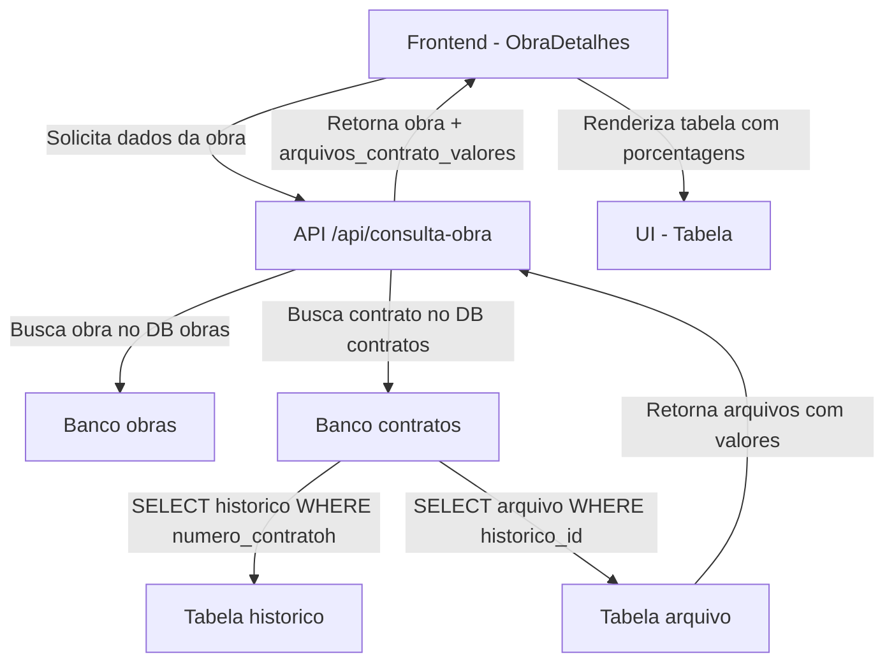

# Implementação de Arquivos do Contrato com Valores e Porcentagens

## Data: 2025-11-13

## Objetivo
Implementar a funcionalidade de exibir arquivos do contrato com seus respectivos valores e porcentagens relativas, seguindo o padrão do sistema Yii2/PHP.

---

## Funcionalidade Implementada

### Exibição de Arquivos do Contrato
Similar ao sistema Yii2/PHP, agora o sistema Next.js exibe:

1. **Tabela de Arquivos do Contrato**
   - Nome do arquivo (PDF)
   - Valor do contrato
   - Porcentagem relativa (quando há múltiplos arquivos/aditivos)

2. **Cálculo de Porcentagem**
   - Valor de referência: primeiro arquivo com valor numérico
   - Porcentagem = (valor do arquivo / valor de referência) × 100
   - Exemplo:
     ```
     Contrato Principal: R$ 2.362.652,37 (100,00 %)
     TA 1º: R$ 814.970,19 (34,49 %)
     TA 2º: R$ 329.400,42 (13,94 %)
     ```

---

## Alterações Realizadas

### 1. API Route (`app/api/consulta-obra/route.ts`)

#### ✅ Nova Busca de Arquivos do Contrato com Valores

Adicionado código para buscar arquivos do sistema de contratos com valores:

```typescript
// Buscar arquivos do sistema de contratos (com valores)
let arquivosContratoComValor: { nome: string; path: string; valor: number; historico_id: number }[] = [];

if (contrato?.numero_contrato && obra.contrato_numero) {
  try {
    // Buscar todos os contratos com esse numero_contratoh
    const [contratosRelacionados] = await connectionContratos!.query<RowDataPacket[]>(
      `SELECT id, valorh FROM historico WHERE numero_contratoh = ? ORDER BY id DESC`,
      [obra.contrato_numero]
    );
    
    if (contratosRelacionados && contratosRelacionados.length > 0) {
      const contratoIds = contratosRelacionados.map((c: RowDataPacket) => c.id);
      const placeholders = contratoIds.map(() => '?').join(',');
      
      // Buscar arquivos desses contratos
      const [arquivosContratoDb] = await connectionContratos!.query<RowDataPacket[]>(
        `SELECT nome_arquivo, path_servidor, historico_id 
         FROM arquivo 
         WHERE historico_id IN (${placeholders})
         ORDER BY historico_id DESC`,
        contratoIds
      );
      
      // Mapear arquivos com valores
      arquivosContratoComValor = (arquivosContratoDb as RowDataPacket[]).map((arq: RowDataPacket) => {
        const contratoRelacionado = contratosRelacionados.find((c: RowDataPacket) => c.id === arq.historico_id);
        return {
          nome: arq.nome_arquivo as string,
          path: arq.path_servidor as string,
          valor: contratoRelacionado ? Number(contratoRelacionado.valorh) || 0 : 0,
          historico_id: arq.historico_id as number
        };
      });
    }
  } catch (error) {
    console.error(`Erro ao buscar arquivos do contrato ${obra.contrato_numero}:`, error);
  }
}
```

**Retorno da API agora inclui:**
```typescript
{
  ...obra,
  arquivos_contrato_valores: arquivosContratoComValor // NOVO CAMPO
}
```

---

### 2. Interfaces (`app/consulta-obra/page.tsx`)

#### ✅ Nova Interface ArquivoContratoValor

```typescript
interface ArquivoContratoValor {
  nome: string;
  path: string;
  valor: number;
  historico_id: number;
}

interface Obra {
  // ...campos existentes
  arquivos_contrato_valores?: ArquivoContratoValor[]; // NOVO
}
```

---

### 3. Componente ObraDetalhes (`components/ObraDetalhes.tsx`)

#### ✅ Seção de Arquivos do Contrato com Tabela

Adicionada nova seção após "Informações do Contrato":

```tsx
{/* Arquivos do Contrato com Valores */}
{obra.arquivos_contrato_valores && obra.arquivos_contrato_valores.length > 0 && (
  <div className="bg-white border-b border-gray-200 p-4">
    <h3 className="text-lg font-semibold text-green-900 mb-3 flex items-center gap-2">
      <span>📎</span> Arquivos do Contrato
    </h3>
    <div className="overflow-x-auto">
      <table className="w-full border-collapse">
        <thead>
          <tr className="bg-green-800 text-white">
            <th className="px-4 py-2 text-left text-sm font-semibold border border-green-700">Arquivo</th>
            <th className="px-4 py-2 text-right text-sm font-semibold border border-green-700">Valor</th>
          </tr>
        </thead>
        <tbody>
          {(() => {
            // Determinar o valor de referência (primeiro valor numérico)
            const valoresNumericos = obra.arquivos_contrato_valores!.filter(arq => arq.valor > 0);
            const valorReferencia = valoresNumericos.length > 0 ? valoresNumericos[0].valor : 0;
            const temMultiplosValores = valoresNumericos.length > 1;

            return obra.arquivos_contrato_valores!.map((arquivo, index) => {
              const porcentagem = valorReferencia > 0 ? (arquivo.valor / valorReferencia) * 100 : 0;
              
              return (
                <tr key={index} className="hover:bg-gray-50 border-b border-gray-200">
                  <td className="px-4 py-3 border border-gray-200">
                    <a href={`https://epamig.tech/contratos/web/${arquivo.path}`} target="_blank">
                      📄 {arquivo.nome}
                    </a>
                  </td>
                  <td className="px-4 py-3 text-right border border-gray-200">
                    {arquivo.valor > 0 ? (
                      <>
                        {formatarValor(arquivo.valor)}
                        {temMultiplosValores && porcentagem > 0 && (
                          <span className="text-sm font-bold text-green-700 bg-green-50 px-2 py-1 rounded ml-2">
                            ({porcentagem.toFixed(2).replace('.', ',')} %)
                          </span>
                        )}
                      </>
                    ) : (
                      <span className="text-gray-400 text-sm">-</span>
                    )}
                  </td>
                </tr>
              );
            });
          })()}
        </tbody>
      </table>
    </div>
  </div>
)}
```

---

## Lógica de Cálculo de Porcentagem

### Regras Implementadas:

1. **Identificar Valor de Referência**
   ```typescript
   const valoresNumericos = obra.arquivos_contrato_valores.filter(arq => arq.valor > 0);
   const valorReferencia = valoresNumericos[0].valor; // Primeiro valor > 0
   ```

2. **Calcular Porcentagem Relativa**
   ```typescript
   const porcentagem = (arquivo.valor / valorReferencia) * 100;
   ```

3. **Exibir Porcentagem Apenas se Houver Múltiplos Valores**
   ```typescript
   const temMultiplosValores = valoresNumericos.length > 1;
   
   {temMultiplosValores && porcentagem > 0 && (
     <span>({porcentagem.toFixed(2)} %)</span>
   )}
   ```

4. **Formatação de Valores**
   - Valores monetários: `formatarValor(valor)` → "R$ 2.362.652,37"
   - Porcentagem: `toFixed(2).replace('.', ',')` → "34,49"

---

## Exemplo de Dados Retornados pela API

```json
{
  "id": 123,
  "numero_contrato": "2023.303",
  "valor_contrato": 2362652.37,
  "arquivos_contrato_valores": [
    {
      "nome": "2023.303 - CONTRATO - URBANO ENGENHARIA.pdf",
      "path": "uploads/contratos/2023.303_contrato.pdf",
      "valor": 2362652.37,
      "historico_id": 1001
    },
    {
      "nome": "2023.303 - TA 1º - URBANO ENGENHARIA.pdf",
      "path": "uploads/contratos/2023.303_ta1.pdf",
      "valor": 814970.19,
      "historico_id": 1002
    },
    {
      "nome": "2023.303 - TA 2º - URBANO ENGENHARIA E CONSTRUÇÕES LTDA.pdf",
      "path": "uploads/contratos/2023.303_ta2.pdf",
      "valor": 329400.42,
      "historico_id": 1003
    }
  ]
}
```

---

## Resultado Visual Esperado

### Tabela de Arquivos do Contrato

| Arquivo | Valor |
|---------|-------|
| 📄 2023.303 - CONTRATO - URBANO ENGENHARIA.pdf | R$ 2.362.652,37 **(100,00 %)** |
| 📄 2023.303 - TA 1º - URBANO ENGENHARIA.pdf | R$ 814.970,19 **(34,49 %)** |
| 📄 2023.303 - TA 2º - URBANO ENGENHARIA E CONSTRUÇÕES LTDA.pdf | R$ 329.400,42 **(13,94 %)** |

---

## Fluxo de Dados



---

## Arquivos Modificados

1. ✅ `app/api/consulta-obra/route.ts` - Busca de arquivos com valores
2. ✅ `app/consulta-obra/page.tsx` - Interface ArquivoContratoValor
3. ✅ `components/ObraDetalhes.tsx` - Componente de exibição da tabela

---

## Testes Recomendados

1. ✅ Verificar se arquivos são buscados corretamente do banco de contratos
2. ✅ Confirmar cálculo de porcentagem relativa
3. ✅ Validar formatação de valores monetários
4. ✅ Testar links de download dos arquivos
5. ✅ Verificar responsividade da tabela em mobile
6. ✅ Confirmar que porcentagem só aparece quando há múltiplos valores

---

## Diferenças em Relação ao Sistema Yii2/PHP

### Sistema Yii2/PHP:
- Busca arquivos diretamente na view
- Usa helpers Yii para formatação
- Calcula porcentagem no loop da view

### Sistema Next.js (Implementado):
- Busca arquivos na API route
- Retorna dados estruturados
- Calcula porcentagem no componente React
- Mais eficiente e separação de responsabilidades

---

## Observações Importantes

### Banco de Dados
- Tabela `historico`: contém contratos com `valorh`
- Tabela `arquivo`: contém PDFs vinculados a `historico_id`
- Relacionamento: `arquivo.historico_id = historico.id`

### Performance
- Busca otimizada com IN clause
- Cache pode ser adicionado futuramente
- Considerar paginação para contratos com muitos aditivos

### Segurança
- Links apontam para domínio externo (epamig.tech)
- Validar se usuário tem permissão para visualizar
- Implementar autenticação no futuro

---

**Desenvolvedor:** GitHub Copilot  
**Data:** 13/11/2025  
**Status:** ✅ Implementado (aguardando teste de build)

